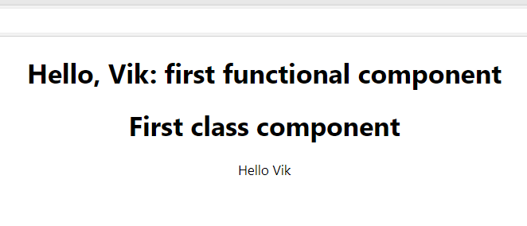
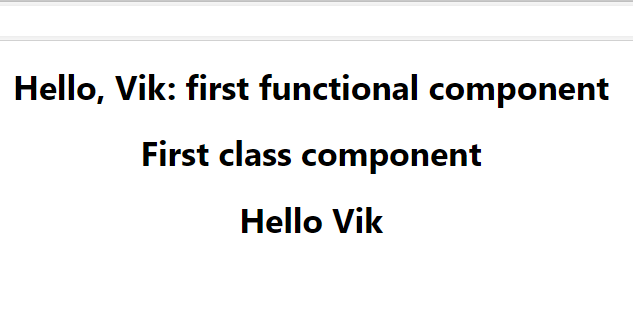
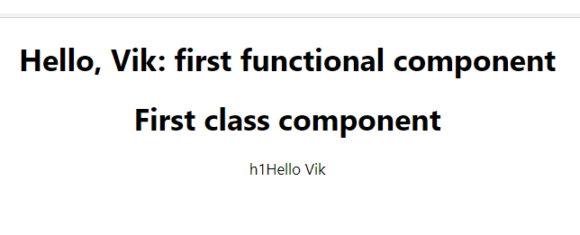

# ReactJS Tutorial: First React app

ReactJS learning journal. Thanks to Codevolution for his detailed [YouTube playlist](https://www.youtube.com/playlist?list=PLC3y8-rFHvwgg3vaYJgHGnModB54rxOk3) on ReactJS! 

## TOC
1. [Intro](#intro)
1. [Hello World: Create React App](#hello-world-create-react-app)
1. [Folder Structure](#folder-structure)
1. [Components](#components)
1. [Functional Components](#functional-components)
1. [Class Components](#class-components)
1. [Functional vs Class Components](#when-to-use-functional-vs-class-components)
1. [Hooks Update](#hooks-update)
1. JSX
1. Props
1. State
1. setState
1. Destructuring props and state
1. Event handling
1. Binding event handlers
1. Methods as props
1. Conditional rendering
1. List rendering
1. Lists and keys
1. Index as key anti-pattern
2. Styling and CSS basics
2. Basics of form handling
2. Component lifecycle methods
2. Component mounting lifecycle methods
2. Component updating lifecycle methods
2. Fragments
2. Pure components
2. memo
2. Refs
2. Refs with class components
3. Forwarding refs
3. Portals
3. Error boundary
3. Higher order components
3. Render props 
3. Context
3. HTTP and React

## Intro
React is an open-source JS library for building user interfaces (UI). 

React's architecture is component-based. An app is compartmentalized that can be put together for more complex UIs. While a traditional website may have DOM sections like a header, sidenav, main content, and footer, ReactJS compartmentalizes these into components. 

React components are reusable. The same component can be reused if the right data is passed in. 

React is a "declarative" library; the React-DOM library builds the UI for the developer while abstracting away logic. In other words, tell React what you want, and React will build the UI. This is like outsourcing the painting of a landscape to an artist, and receiving the painting back when it's finished. React also efficiently handles updating and rendering the components.

An "imperative" implementation involve explicitly writing out an algorithm. In the artist analogy, this is like you controlling the flow by drawing the parts of the landscape yourself. 

ReactJS allows seamless integration of React into Web apps. This can be just a portion of a page, or the whole application itself. 

React Native is for mobile development. 

It's important to know the following before diving into ReactJS: 
- HTML
- CSS
- JS fundamentals
  - 'this'
  - Arrays: filter, map, reduce
  - ES6
    - Let, const
    - Arrow functions
    - Template literals
    - Default parameters
    - Object literals
    - Rest, spread operators
    - Destructuring assignment

## Hello World: Create React App

To get started, you need Node.js (runtime environment that runs JS code outside a web browser) and an IDE. 

To create a React app, go to a CLI and enter `npx create-react-app hello-world`. 

There are two main approaches to create/setup a React app: `npx` and `npm`. 
- `npx`
  - `npx create-react-app <project-name>`
  - Npx is an npm package runner that is installed when Node.js is installed. 
  - This allows the create-react-app to run without installing it - npx takes care of this for us. No need to install a global package or update the create-react-app package. 
- `npm`
  - `npm install create-react-app -g`, then `create-react-app <project_name>`
  - This installs create-react-app package globally and uses the package to generate the project. 
  - This approach is possible, but less preferred. 

Start the app server with `npm start` in the CLI. 


[Back to Top](#toc)

## Folder Structure

It's important to understand the files/folders involved and the control flow when the app is run. 

Important files/folders to know are: 
- `package.json`
  - Dependencies and scripts for project
  - Ex. version 16.13.1 is a dependency itself
- `package-lock.json`
  - Ensures dependencies are installed correctly
- `node_modules`
  - All dependencies are installed here for `npm install` or `create-react-app`
- `public`
  - `manifest.json`
    - For progressive Web apps
  - `index.html`
    - Only 1 HTML file is needed, which is used for a single-page app. The page will change dynamically. 
    - No code is needed here; React will control the UI at `<div id="root"></div>`
- `src`
  - `index.js`
    - Starting point of React app is here: `ReactDOM.render(<App />, document.getElementByID('root'));`
    - Specify root component with `<App />` component and is controlled by React, and the DOM element with `id=root` is controlled by React
    - The `<App />` component is rendered inside the "root" DOM node
  - `App.js`
    - This is responsible for the HTML, and thus view, displayed in the browser. 
  - `App.css`
    - Styling
  - `App.test.js`
    - Unit testing
  - `Index.css`
    - Style for the body tag
  - `Logo.svg`
    - Referenced in the App component
  - `serviceworker.js`
    - Progressive Web apps

[Back to Top](#toc)

## Components Overview

Suppose an app contains the previously discussed 5 components - header, sidenav, main, footer, and one component to contain all the other components ("root", named App). Each component describes only part of the UI, and each component comes together to make an entire app. These components are reusable and can be nested inside other components. The same component can also be used with different propreties to display different information. 

The component code is placed in JS files. JS files can have a .js or .jsx extension. 
- App component in App.js
- Code for component is inside .js file, but the code depends on the type of component. 

Types of components: 
- Stateless functional component
  - This is literally a JS function which returns HTML, which in turn describes the UI. 
  ```
  function Welcome(props) {
    return <h1>Hello, {props.name}</h1>
  }
  ```
- Stateful class component
  - This is a regular ES6 class that extends the component class from the React library. 
  - It must contain a method that returns HTML. 
  ``` 
  class Welcome extends React.Component {
    render() {
      return <h1>Hello, {this.props.name}</h1>
    }
  }
  ```

[Back to Top](#toc)

## Functional Components

Functional components are just JS functions. They accept an optional object parameter called Properties (props). The component returns HTML (AKA JSX), which describes the UI. 

Start a components folder within src. 

To create a component, create a .js file named anything you want in the folder. 

Import React from its library in this file via `import React from 'react'`. For every component created, be sure to import React. 

It's possible to create the new functional component via a traditional JS function `function Greet() { }` that returns some desired HTML `return <h1>Hello, Vik</h1>`. 

It's also possible and preferred to use an ES6 arrow function `const Greet = () => <h1>Hello, Vik</h1>`. 

To connect the component to the App, go to App.js and add the new component in the existing App component. To do this, first export the component from the component file via `export default Greet`. Then import the component in App.js via `import Greet from '<location>'` and use the component as a custom element within `<div className="App"></div>`. 

In the App component, replace the template HTML (except the outer div tag) with the custom component's name. 

```
// Greet.js
import React from 'react'

const Greet = () => <h1>Hello, Vik</h1>

export default Greet
```

```
// App.js
import React from 'react';
import logo from './logo.svg';
import './App.css';
import Greet from './components/Greet'

function App() {
  return (
    <div className="App">
      <Greet />
    </div> // if no content that goes within the custom Greet tag, then make it a self-closing tag
  );
}
```

If `default` is used in the export statement in this manner, the component can be renamed to anything in the main App component, wherever `Greet` is seen. 

Default exports are preferred and more commonly used, but it's possible to also see named exports. If the component is name exported, the import statement in App.js changes to surround the component name with curly braces. 
```
// Greet.js
export const Greet = () => <h1>Hello, vik</h1>
```

```
// App.js
import { Greet } from './components/Greet'
```

This would fix the name of the component, thus not allowing renaming of the new component in App.js. 


[Back to Top](#toc)

## Class Components

Class components are similar to functional components; they too can receive an input 'props' parameter object and return HTML. 

Class components are distinct, because they maintain an internal (informational) private state. This information is still used to describe the UI. 

Create a new .js file in a components folder (under src). 

Import React AND the Component class via `import React, { Component } from 'react'`. 

The new class will extend the Component class. It also requires a render method that returns HTML. 

Defualt export the class, and import the class in App.js. Use the new component in the HTML as its custom HTML tag. 

```
// Welcome.js
import React, { Component } from 'react'

class Welcome extends Component {
  render() {
    return <h1>Class component</h1>
  }
}

export default Welcome
```

```
// App.js
import Welcome from './components/Welcome'

function App() {
  return (
    <div className="App">
      <Greet />
      <Welcome />
    </div>
  );
}
```


[Back to Top](#toc)

## Functional vs Class Components

When to use a functional vs. class component?

Functional components:
- Are for simple functions
- Are to be used as much as possible. If it's possible to create a component with either functional vs. class approaches, always go with the functional approach
- Are mainly responsible for the UI
- Are AKA stateless/dumb/presentational components
- Advantage: absence of the 'this' keyword
- Advantage: it's a solution that doesn't need to use state _(no longer true with Hooks update - state can now be implemented without writing a class)_, and therefore less logic is required
- Disadvantage: not for more complex UI logic

Class components: 
- Are more feature rich
- Maintain their own private data, AKA state
- Are AKA stateful/smart/container components
- Advantage: can handle more complex UI logic
- Advantage: most importantly, provides lifecycle hooks _(no longer true with Hooks update - hooks can also be used in functional components)_
- Disadvantage: more logic required to implement 
- Disadvantage: If there are a number of components, each with a private state, maintenance/debugging can be difficult between them

[Back to Top](#toc)

## Hooks Update

As of Oct 29, 2018: Hooks are a new feature proposal that lets you use state and other React features without writing a class. This means that state and code similar to lifecycle hooks, which were exclusive to class components, can also be used in functional components. 

There are no breaking changes with older versions. 

Hooks are opt-in. 

Hooks are 100% backwards compatible. 

Hooks are not necessary for a React app, thus not needed to learn. Functional vs class component comparisons still hold true, except that functional components can hold state and/or use lifecycle hooks, if needed. 

[Back to Top](#toc)

## JSX

JSX is an extension to the JavaScript language syntax; it's XML-like code for elements and components in React. 

JSX tags consist of a tag name, attributes, and children. 

JSX isn't required to write a React app, but it makes React simpler and elegant. It ultimately transpiles to pure JavaScript, which is understood by the browser. 

The following shows how a component is written without JSX and with. 

### Without JSX

React contains a method called `createElement()` which takes in 3 parameters at minimum. The 1st is a String type which specifies the HTML tag to be rendered. The 2nd is optional and used for attribute creation. The 3rd consists of children of the HTML element, most commonly a `<div>`. 

```
// Hello.js
const Hello = () => {
    return React.createElement('div', null, 'Hello Vik');
}

export default Hello
```

```
// App.js
import Hello from './components/Hello'

function App() {
  return (
    <div className="App">
      <Greet />
      <Welcome />
      <Hello />
    </div>
  );
}

export default App
```

As it's written, when this component is imported into App.js and rendered, it will present like this: 



The DOM node is rendered as a text element. To wrap it with a tag like `<h1></h1>` and render it as such, an additional element needs to be created within the `createElement()` method, via - you guessed it - `React.createElement()`. This would go where the child node of the parent needs to be created, which is the 3rd parameter of `createElement()`. 

```
// Hello.js

const Hello = () => {
  return React.createElement(
    'div', 
    null, 
    React.createElement('h1', null, 'Hello Vik')
  )
}
```



The following implementations will render text nodes and not the actual `<h1>` tag. 

```
// rendered as the text seen
const Hello = () => {
  return React.createElement('h1', null, '<h1>Hello Vik</h1>')
}

// createElement() can take in more than 3 parameters for multiple tags at once, but this implementation will still render as text
const Hello = () => {
  return React.createElement('h1', null, 'h1', 'Hello Vik')
}
```


To add attributes to nodes, fill in the second parameter with key-value pairs inside an object (specified by curly brackets). 

```
const Hello () => {
  return React.createElement('div', { id: 'hello', className: 'dummy' }, React.createElement('h1', null, 'Hello Vik'))
}
```

### JSX differences

There are conflicts between JSX and HTML syntax. For example, 'class' is a reserved name in React for React class components. Thus, 'className' is used in lieu of what we understand as HTML 'class'. If 'class' was used in place of 'className' and similarly with other conflicts, a browser console warning would appear and display something like: "Warning: Invalid DOM property 'class'. Did you mean 'className'?" Below are further JSX differences from HTML: 

HTML vs. JSX version
- class -> className
- for -> htmlFor
- camelCase property naming convention:
  - onclick -> onClick
  - tabindex -> tabIndex

### With JSX

This is the version most familiar - and much more elegant - at this point. Take note of how element attributes are added as well - it's about what is expected, minus the JSX differences in attribute types. 

```
// Hello.js

import React from 'react'

const Hello = () => {
  return <h1 id="hello" className="dummy">Hello Vik</h1>
}

export default Hello
```

In essence, a JSX element is syntactic sugar for calling `React.createElement()`. This is why React is imported via `import React from 'react'`; this allows the ability to use JSX through the React library, in lieu of the more cumbersome method outlined above. 

### Future changes

As of 2018, there are considerations being made within Facebook about when to implement breaking changes to the React code. One of these includes changing "className" into "class". These changes are targeted for React 18 or 19. This link - [https://github.com/facebook/react/issues/13525](https://github.com/facebook/react/issues/13525) - outlines changes considered at the time. 

